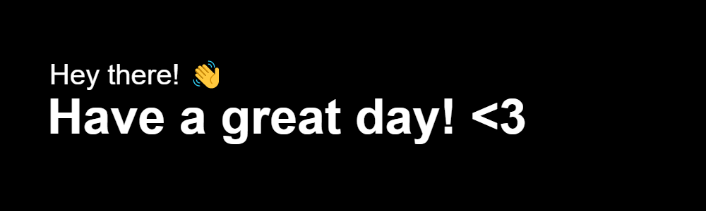

<!-- For the sake of modularity (and accessibility), unused utilities are at last -->
<!-- Do not trim the whitespaces: easier readability -->
<!-- To do:  -->

<!-- Animation SVG: -->

  

<!-- Cover PNG: -->

<!-- 1. `src` = URL: -->

<!--

-->

<!-- 2. `src` = Path: -->

<!-- Views counter: -->

  

<!-- Follow me button (GitHub): -->

  

<!-- Subtitle -- Dynamic SVG: -->

  

<!-- Streaks: -->

<h2 align="center">Streaks 🔥</h2>

  

<!-- GitHub Stats: -->

<h2 align="center">Statistics 🖥️</h2>

&nbsp;

<!-- Languages and tools: -->

<h2 align="center">Languages, frameworks and tools 🛠️</h2>

 

                                                              

<!-- Top languages: -->

<h3 align="center">Top languages</h3>

<h6 align="center">· currently erroneous</h6>

<!-- Contributions graph: -->

<h2 align="center">Contribution graph 📈</h2>

<h6 align="center">· currently erroneous</h6>

<!-- <h6 align="center">· uh oh, a rugpull! 📉</h6> -->

<!-- 1. Manually-hosted (Heroku) -->

<!--

-->

<!-- 2. Globally-hosted -->

<!--

-->

<!-- Quotes: -->

<h2 align="center">Quotes 📝</h2>

<!-- 1. Non-customizable but can be aligned center; Themes: nord, light, dark, graywhite; Horizontal/Vertical -->

  

<!-- 2. Customizable but cannot be aligned center -->

<!--

  

-->

<!-- Jokes: -->

<h2 align="center">Not-so-corny jokes 🙈</h2>

<!-- Parameters are customized -->

<!-- Spotify (Now playing): -->

<h2 align="center">Currently playing 🎶</h2>

<h6 align="center">· currently erroneous</h6>

  

<!-- Details tag: -->

<h6 align="center">· click to reveal; unclick to hide</h6>

<!-- Naval quotes: -->

Excerpt of the Day 📝

<h6 align="center">· updated arbitrarily for quality</h6>

 
 
 

<h4 align="center"><q>The overeducated are worse off than the undereducated, having traded common sense for the illusion of knowledge.</q></h4>

 
 
 
 

<!-- Dev. metrics -- Wakatime: -->

Weekly dev. metrics 📊

<h6 align="center">· automated, grammar funky at times</h6>

<!--START_SECTION:waka-->

<!--END_SECTION:waka-->

<!-- PageSpeed web metrics -->

PageSpeed web. metrics 📑

 
 

	 

 

<!-- Snake contribution-grid mini-game -- Animation SVG: -->

<!--

Contribution-grid (🐍!)

 

  

 

  

-->

<!-- Recent activity: -->

Recent activity ⚡

 

<!--START_SECTION:activity-->
1. 🗣 Commented on [#121](https://github.com/PatrickAlphaC/hardhat-smartcontract-lottery-fcc/issues/121) in [PatrickAlphaC/hardhat-smartcontract-lottery-fcc](https://github.com/PatrickAlphaC/hardhat-smartcontract-lottery-fcc)
2. 🗣 Commented on [#110](https://github.com/PatrickAlphaC/hardhat-smartcontract-lottery-fcc/issues/110) in [PatrickAlphaC/hardhat-smartcontract-lottery-fcc](https://github.com/PatrickAlphaC/hardhat-smartcontract-lottery-fcc)
3. 🗣 Commented on [#3491](https://github.com/smartcontractkit/full-blockchain-solidity-course-js/issues/3491) in [smartcontractkit/full-blockchain-solidity-course-js](https://github.com/smartcontractkit/full-blockchain-solidity-course-js)
4. 🗣 Commented on [#3491](https://github.com/smartcontractkit/full-blockchain-solidity-course-js/issues/3491) in [smartcontractkit/full-blockchain-solidity-course-js](https://github.com/smartcontractkit/full-blockchain-solidity-course-js)
5. 💪 Opened PR [#1](https://github.com/zjy-1998/nextjs-smartcontract-lottery-fcc/pull/1) in [zjy-1998/nextjs-smartcontract-lottery-fcc](https://github.com/zjy-1998/nextjs-smartcontract-lottery-fcc)
5. 💪 Opened PR [#2](https://github.com/TimeKeyRoll/hardhat-nft-fcc/pull/2) in [TimeKeyRoll/hardhat-nft-fcc](https://github.com/TimeKeyRoll/hardhat-nft-fcc)
<!--END_SECTION:activity-->

<!-- Pawwots -->

Birbs? 🦜

<h6 align="center">· sorry... too cute to be excluded 😬</h6>

    
    <!--  -->
    
    <!--  -->
    
    
    
    
    
    
    
    
    
    
    
    
    
    
    
    
    
    
    
    

<!-- Animation SVG: -->

  

<!-- Unused utilities: -->

<!-- Music detailed: --> 

<!--
<td width="50%">
  

  <a href="https://readme.andyruwruw.com/api/now-playing?open">
    Comment: Music bars move to the beat and are colored based on the track's happiness, danceability and energy! 
    
  </a>

  

  Comment: He came up with the idea of HOW to show React components as an img on a README.md and the now playing component! 
  <i>inspired by <a href="https://github.com/natemoo-re">natemoo-re</a></i>

-->

<!-- Detailed GitHub Stats: (Lines of code and more) -->

<!--

-->

<!-- Memes: -->

<!--
<h2 align="center">Dev. memes! ^_____^ </h2>

<h6 align="center">· who doesn't love memes? :p</h6>

  

-->

<!-- Cover SVG -- (`Hello World` in numerous languages): -->

<!--

  

-->

